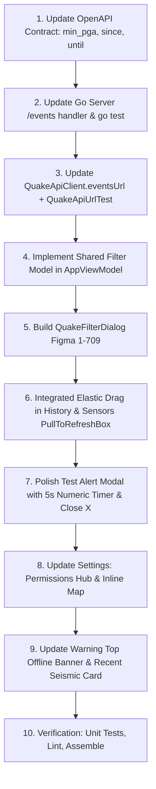

# IMPLEMENTATION PLAN: UI/UX Refinements & Feature Upgrades (Fase 2 — Production-Ready)

Dokumen rencana implementasi yang disempurnakan berdasarkan verifikasi mendalam terhadap kontrak OpenAPI (`contracts/openapi/openapi.yaml`), arsitektur server Go (`server/`), kapabilitas sensor fisik MEMS, dan kode Android client.

---

## 1. Goal Description

Menyempurnakan antarmuka pengguna (UI), keandalan penanganan error (*disaster resilience*), dan fungsionalitas aplikasi Android **QuakeAlert** secara terukur dan presisi:

1. **Modal Test Alert Sound**: Penambahan tombol tutup standar (X) dan penunjuk sisa waktu numerik (`5s` $\rightarrow$ `1s`).
2. **Settings Screen & Permissions Checker**: Pengelompokan menu Settings dengan panel verifikasi izin sistem (Notifikasi, Lokasi, Optimasi Baterai).
3. **Integrated Elastic Pull-To-Refresh (iOS-Feel)**: Menerapkan translasi elastis halus pada konten list berbasis `PullToRefreshState.distanceFraction` (`graphicsLayer { translationY = ... }`) sehingga tarikan terasa membal, mewah, dan 100% bebas konflik gesture.
4. **Desain Error & No-Data UI Baru (Figma node 148:1066)**: Satu kartu berbahasa visual sama dengan **tiga varian** — *error* (gagal menghubungi jaringan), *no data* (filter tidak menghasilkan apa pun), dan *no sensor coverage* (di luar jangkauan jaringan sensor) — dipakai tab History & Sensors. Lihat §E.
5. **Handling Error Halaman Warning**: Notifikasi offline di bagian ATAS (Top Bar & Offline Banner) sehingga **Panduan Siaga Gempa** dan **Tombol Emergency CTA** tetap 100% tampil saat jaringan seluler mati saat bencana.
6. **Filter Shaking Intensity & Search Radius (Figma node 1-709)**:
   - Filter berbasis **Intensitas Guncangan (MMI)** sesuai fisika sensor akselerometer MEMS (bukan magnitudo Richter).
   - Pengaturan **Search/Browse Radius** (100 / 250 / 500 / 1000 km) yang secara tegas tidak mengubah *alert radius* 200 km. Tab Sensors di-*clamp* ke 500 km (batas `/sensors`, lihat §C).
   - Filter diimplementasikan secara **Server-Side** (kontrak OpenAPI $\rightarrow$ handler `/events`) agar tidak merusak paginasi *infinite scroll*. Ambang intensitas dikirim sebagai `min_pga` (gal), bukan `min_mmi` — lihat §B.
7. **Pembersihan Map Sensor**: Menghapus shortcut navigasi ke Settings pada kartu peta sensor.
8. **Kartu Recent Seismic Activity (sebelumnya Earthquake Possibility)**: Menyajikan statistik aktivitas kegempaan terkini secara ilmiah (bukan prediksi gempa).
9. **Integrasi Peta Settings Terpadu**: Menyatukan parameter `SensorMapCard` (opsi `showGeofence = false`, `height = 130.dp`) ke dalam kartu *Sync Location Now* dengan badge *"Last Sync"*.
10. **Status Koneksi Top Bar**: Memverifikasi dan mengonfirmasi integrasi `ServerConnectionState` yang sudah aktif.

---

## 2. Technical Revisions & Ground Truth Alignment

```
┌────────────────────────────────────────────────────────────────────────────┐
│                    ALUR FILTER & PAGINASI SERVER-SIDE                      │
├────────────────────────────────────────────────────────────────────────────┤
│ 1. KONTRAK OPENAPI: contracts/openapi/openapi.yaml                         │
│    - Parameter query baru: min_pga (gal), since, until                     │
│                                                                            │
│ 2. BACKEND SERVER: server/internal/api/ (Go)                               │
│    - SQL dinamis: WHERE max_pga >= min_pga AND started_at >= since         │
│    - Paginasi 20 item tetap utuh tanpa terpotong di client                 │
│                                                                            │
│ 3. ANDROID CLIENT: HistoryViewModel & SensorsViewModel                     │
│    - Shared session state di AppViewModel                                  │
│    - Infinite scroll & LOAD_MORE_THRESHOLD bekerja 100% mulus              │
└────────────────────────────────────────────────────────────────────────────┘
```

### A. Integrated Elastic Drag (iOS-Feel) pada Pull-To-Refresh
> [!TIP]
> **Arsitektur Animasi Bebas Konflik Gesture**:
> Alih-alih membuat modifier kustom terpisah yang berisiko bertabrakan dengan *nested scroll*, kita menerapkan translasi GPU langsung pada konten di dalam `PullToRefreshBox`:
> ```kotlin
> val state = rememberPullToRefreshState()
> PullToRefreshBox(
>     isRefreshing = uiState.isRefreshing,
>     onRefresh = onRefresh,
>     state = state,
>     modifier = modifier
> ) {
>     val bodyModifier = Modifier
>         .fillMaxSize()
>         .graphicsLayer {
>             // Translasi elastis halus seiring tarikan jari (0dp -> ~40dp)
>             translationY = state.distanceFraction * 40.dp.toPx()
>         }
>     // LazyColumn / Skeleton / Error / Empty Content menggunakan bodyModifier
> }
> ```
> **Keunggulan**:
> - Konten list terdorong turun secara elastis dan membal halus saat dilepas.
> - Menggunakan `graphicsLayer` yang dieksekusi langsung pada RenderNode GPU (60/120 fps tanpa recomposition).
> - Keandalan pemicu `onRefresh` tetap terjamin 100% tanpa perebutan gesture.
>
> **Dua detail wajib** (terverifikasi pada material3 1.3.0 — `PullToRefreshState.distanceFraction` dan parameter `state` pada `PullToRefreshBox` memang tersedia):
> - `PullToRefreshBox` **tidak** melakukan clipping, sehingga translasi 40dp akan menimpa bottom navigation bar saat ditarik. Body berbobot (`weight(1f)`) wajib memakai `Modifier.clipToBounds()`.
> - `graphicsLayer` dipasang **di luar** `fadingEdges()` yang sudah ada, agar gradien fade ikut bergerak bersama konten, bukan tertinggal pada batas asli.

---

### B. Intensitas Guncangan (MMI) vs Fisika Sensor
> [!IMPORTANT]
> Jaringan sensor QuakeAlert adalah sensor akselerometer permukaan (MEMS), yang mengukur **Percepatan Tanah Puncak (PGA dalam gal)** dan mengonversinya ke **Modified Mercalli Intensity (MMI)** — bukan magnitudo Richter/Mw.
>
> **Opsi Filter Intensitas**:
> - **All Intensities**: Semua data yang tercatat jaringan sensor.
> - **Felt (MMI IV+)**: Guncangan ringan yang dirasakan orang banyak.
> - **Moderate (MMI VI+)**: Guncangan sedang yang berpotensi merusak plester/benda gantung.
> - **Severe (MMI VII+ / PGA $\ge$ 250 gal)**: Selaras dengan `SafetyPolicy.OVERRIDE_MMI` dan `OVERRIDE_PGA_GAL`.
>
> **Ambang dikirim dalam gal, bukan MMI.** Tabel `earthquake_events` menyimpan `mmi_scale VARCHAR(10)` (angka Romawi) dan `max_pga NUMERIC(8,4)`; **tidak ada kolom `mmi_rank`**, jadi perbandingan numerik hanya mungkin pada `max_pga` — tanpa migrasi baru.
> Konversi bucket $\rightarrow$ gal **wajib diturunkan dari satu sumber yang sudah ada**, `server/internal/consensus/centroid.go` (`Intensity` / `MMIFromPGA`, tabel ambang SYSTEM_SPEC Bab 5.3: `< 16.6` light, `16.6..137.2` moderate, `>= 137.2` strong). Nilai cermin di sisi Android diletakkan bersama `SafetyPolicy.OVERRIDE_PGA_GAL` dengan disiplin "harus sama dengan server" seperti `ALERT_RADIUS_KM`. Label di UI tetap MMI.

---

### C. Browse Search Radius vs Fixed Safety Alert Radius
> [!NOTE]
> - **Life-Safety Alert Radius**: Tetap **200 km** (`SafetyPolicy.ALERT_RADIUS_KM`), tidak dapat diubah pengguna demi perlindungan nyawa.
> - **Browse Search Radius**: Opsi penelusuran riwayat: **100 km / 250 km (default History) / 500 km / 1000 km**.
> - UI Filter Sheet secara gamblang mencantumkan keterangan: *"Filter ini hanya mengatur tampilan daftar, tidak mengubah radius peringatan darurat 200 km."*
> - **Batas per-endpoint berbeda**: `/events` menerima `range_km` sampai 2000, tetapi `/sensors` hanya sampai 500 (`QuakeApiClient`, mengikuti `server/internal/api/api.go`). Karena filter tersinkronisasi lintas tab, pilihan 1000 km **di-clamp ke 500 km untuk tab Sensors** dan clamp itu ditampilkan di sheet — jangan dibiarkan senyap, karena permintaan di atas batas ditolak server.
> - **Filter bersifat session-only** di `AppViewModel` (bukan DataStore): pengguna yang meninggalkan filter sempit pekan lalu lalu membuka aplikasi saat gempa harus melihat semuanya, bukan potongan basi.

---

### D. Filter Server-Side untuk Melindungi Paginasi REST
- Menyaring data 20 item secara *client-side* setelah paginasi akan menyebabkan halaman menjadi pendek (misal hanya tersisa 2 item), yang merusak deteksi `LOAD_MORE_THRESHOLD` pada Compose `LazyColumn`.
- **Langkah**: Tambahkan parameter query `min_pga`, `since`, `until` pada `contracts/openapi/openapi.yaml` lalu pada handler events di `server/internal/api/api.go` (tidak ada `events.go`; `eventDTO` dan handler berada di `api.go`), sesuai ADR-0004 kontrak lebih dulu.

---

### E. Kartu Error & No-Data Satu Bahasa Visual (Figma node 148:1066)
> [!IMPORTANT]
> Search radius mencapai 1000 km sementara jaringan sensor bersifat regional, jadi kueri yang sah **pasti** akan mengembalikan nol hasil. Menampilkan "No Earthquake History" pada kondisi itu menyesatkan: ia terbaca *"tidak ada gempa di sana"*, padahal kenyataannya *"jaringan kami belum mengamati wilayah itu"*.
>
> **Spesifikasi kartu (diambil dari Figma 148:1066)**:
> - Kontainer: kolom, padding 25px, `space-between`, center, 346x322, isian gradien hitam, stroke putih 10% 1px, radius 14px.
> - Glyph 50x50 (`alert-triangle`, komponen 1:683 untuk varian error).
> - Judul: Nunito Bold 20/36, putih, center.
> - Pesan: Nunito Bold 16/24, putih, center, dalam frame ber-*glow* `0 4 30 rgba(255,255,255,0.58)`.
> - Aksi: kapsul selebar kartu, padding 6x10, isian putih 31%, stroke putih 30% 2px, radius 10px, label Nunito Bold 13/36.
>
> **Tiga varian dengan chrome yang sama**:
>
> | Varian | Glyph | Judul | Pesan | Aksi |
> |---|---|---|---|---|
> | Error jaringan | `alert-triangle` | Something Went Wrong | Could not reach sensor network. Check your connection and try again. | Retry |
> | Tidak ada data untuk filter | `ic_nav_history` | No Data Available | Menyebut filter aktif, mis. *"No events at MMI VI+ within 250 km in the past 7 days."* | Reset Filters |
> | Di luar jangkauan sensor | `ic_nav_sensors` | No Sensors In This Area | Menyatakan ini batas cakupan, bukan ketiadaan gempa: *"QuakeAlert's sensor network does not cover this area yet."* | Widen Search Radius |
>
> **Pemisahan error vs empty tetap dipertahankan**: error berarti pertanyaannya gagal diajukan sehingga menawarkan *Retry*; hasil kosong adalah jawaban yang sah sehingga menawarkan cara melebarkan pertanyaan. Aksi **dihilangkan** bila tidak ada filter yang menyempitkan kueri, supaya feed kosong apa adanya tidak menawarkan "reset" yang tak berguna.
>
> **Implementasi**: memakai kembali seam privat `StateBlock` di `ui/common/QuakeStateComponents.kt` — chrome kartu diubah sekali di sana dan ketiga varian mengikuti, alih-alih menambah state publik keempat yang bisa melenceng.

---

## 3. Execution Sequence



---

## 4. Proposed File Changes

| File | Komponen | Aksi | Deskripsi Perubahan |
|---|---|---|---|
| `contracts/openapi/openapi.yaml` | Contract | **MODIFY** | Tambah query params: `min_pga`, `since`, `until` pada `/api/v1/events`. |
| `server/internal/api/api.go` | Server Go | **MODIFY** | Handler events + SQL dinamis `max_pga >= min_pga`, `started_at` antara `since`/`until`. |
| `server/internal/api/api_test.go` | Server Go | **MODIFY** | Test unit Go untuk query filter baru. |
| `android/app/.../data/network/QuakeApiClient.kt` | Android Data | **MODIFY** | `eventsUrl(...)` (fungsi murni yang sudah ada) memasang `min_pga`, `since`, `until`; hilangkan param bila tidak diset. |
| `android/app/.../test/.../QuakeApiUrlTest.kt` | Android Test | **MODIFY** | Verifikasi query string baru & pemetaan bucket MMI $\rightarrow$ gal. |
| `android/app/.../ui/app/AppViewModel.kt` | Android UI | **MODIFY** | Session-level shared filter state (`QuakeFilterState`). |
| `android/app/.../ui/history/HistoryScreen.kt` | Android UI | **MODIFY** | Terapkan *Integrated Elastic Drag* via `graphicsLayer { translationY = state.distanceFraction * 40.dp }`. |
| `android/app/.../ui/sensors/SensorsScreen.kt` | Android UI | **MODIFY** | Terapkan *Integrated Elastic Drag* via `graphicsLayer { translationY = state.distanceFraction * 40.dp }`. |
| `android/app/.../device/TestAlertPlayback.kt` | Android Device | **MODIFY** | `remainingSeconds: StateFlow<Int>` (5s countdown). |
| `android/app/.../ui/common/TestAlertSoundDialog.kt` | Android UI | **MODIFY** | `QuakeModalHeader` (close X) & render hitungan mundur `START (5s)`. |
| `android/app/.../ui/common/QuakeFilterRow.kt` | Android UI | **MODIFY** | Bersihkan label "Near", pasang tombol filter sliders (Figma 1-709). |
| `android/app/.../ui/common/QuakeFilter.kt` | Android UI | **MODIFY** | Enum hari ini hanya `{ ALL, NEAR }`; jadikan `QuakeFilterState` pembawa intensitas, radius, dan rentang waktu. File pertama yang disentuh pekerjaan filter. |
| `android/app/.../ui/common/QuakeFilterDialog.kt` | Android UI | **NEW** | Modal filter MMI, Search Radius, dan Rentang Waktu. |
| `android/app/.../ui/common/QuakeStateComponents.kt` | Android UI | **MODIFY** | Chrome kartu Figma 148:1066 pada `StateBlock`; varian error / no-data / no-coverage (§E). |
| `android/app/.../ui/sensors/SensorMapCard.kt` | Android UI | **MODIFY** | Hapus shortcut settings, tambah parameter `showGeofence` & `height`. |
| `android/app/.../ui/settings/SettingsScreen.kt` | Android UI | **MODIFY** | Integrasi Permissions Hub & inline map pada *Sync Location*. |
| `android/app/.../ui/settings/SettingsComponents.kt` | Android UI | **MODIFY** | Komponen UI Permissions Hub (Notif, Lokasi, Doze). |
| `android/app/.../ui/warning/WarningScreen.kt` | Android UI | **MODIFY** | Top status banner saat offline, jaga tips siaga & Emergency CTA tetap aktif. |
| `android/app/.../ui/warning/WarningComponents.kt` | Android UI | **MODIFY** | Refactor "Earthquake Possibility" menjadi "Recent Seismic Activity" berbasis data riil. |

---

## 5. Verification Plan

### Automated Tests
1. **Server (Go)**:
   ```bash
   cd server && go test -v ./... && go vet ./...
   ```
2. **Android**:
   ```bash
   cd android && ./gradlew testDebugUnitTest lintDebug assembleDebug
   ```

### Manual Verification
1. **Elastic Pull-to-Refresh**: Tarik list History & Sensors ke bawah $\rightarrow$ amati translasi list yang melar dan membal mulus, **tanpa** menimpa bottom navigation bar $\rightarrow$ lepaskan dan pastikan pembaruan data terpicu 100% tanpa lag.
2. **Test Alert Sound**: Uji tombol close (X), hitungan mundur `START (5s)` $\rightarrow$ `PLAYING (4s)` ... $\rightarrow$ `START`, serta pembatalan instan tombol STOP.
3. **Filter & Paginasi**: Buka Filter Sheet $\rightarrow$ ubah filter ke MMI VI+ $\rightarrow$ verifikasi list History memuat 20 item per halaman dari server tanpa terpotong $\rightarrow$ ganti ke tab Sensors dan pastikan filter tersinkronisasi serta clamp 500 km terlihat.
4. **No-Data & No-Coverage**: Set filter yang pasti kosong (mis. MMI VII+ radius 100 km) $\rightarrow$ pastikan kartu §E menyebut filter aktif dan menawarkan *Reset Filters*; set radius jauh di luar cakupan $\rightarrow$ pastikan pesan berbunyi batas cakupan, bukan ketiadaan gempa.
5. **Settings Permissions & Map**: Verifikasi 3 status izin di panel atas Settings $\rightarrow$ periksa peta terpadu di dalam kartu *Sync Location Now*.
6. **Warning Offline Resilience**: Putuskan koneksi $\rightarrow$ amati top offline banner $\rightarrow$ pastikan panduan siaga dan tombol Emergency CTA tetap aktif.
