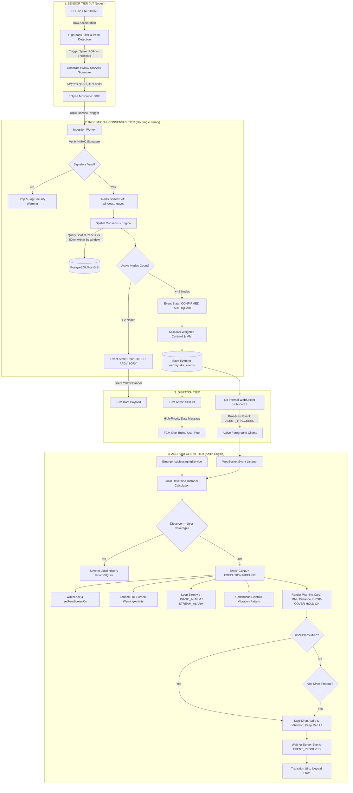
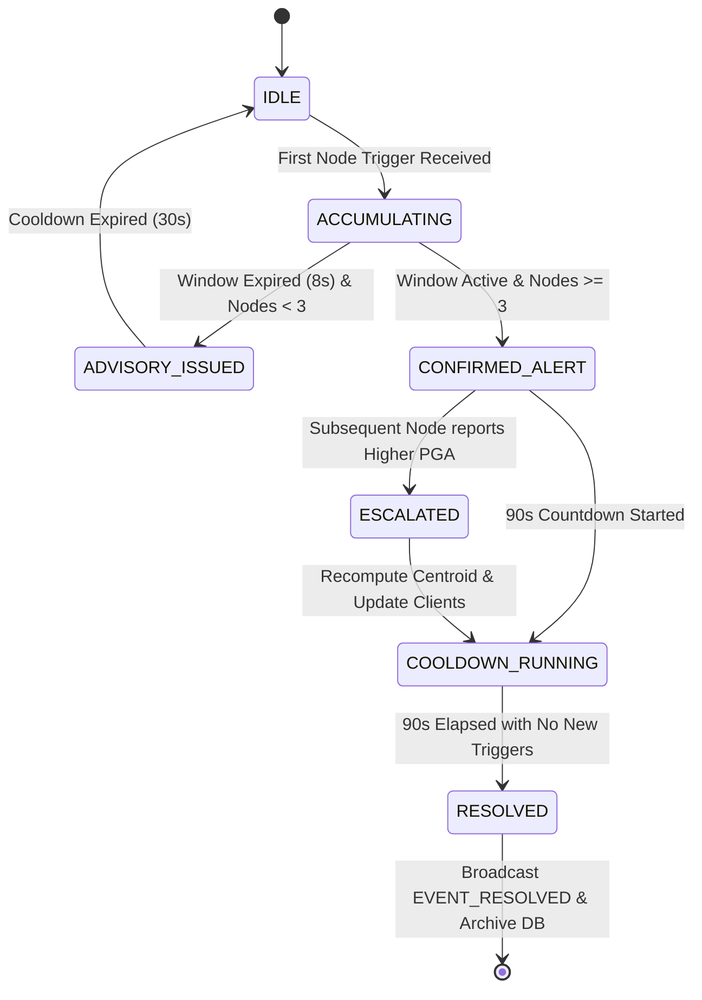
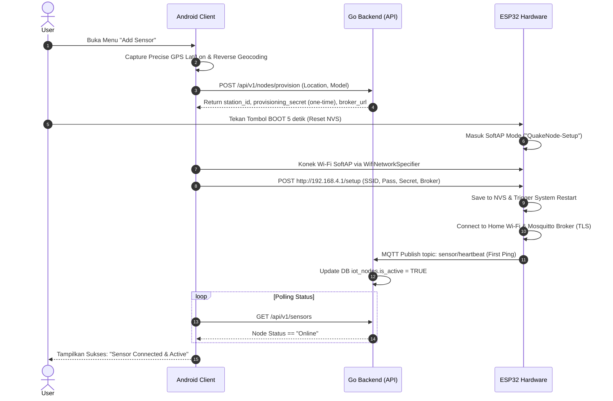

> # ⚠️ HISTORICAL — DO NOT USE FOR IMPLEMENTATION DECISIONS
>
> This document describes the **Phase 2 consensus architecture**, which has been
> **SUPERSEDED by Phase 3** (commits `9752c5e`, `1ad1777`). It is retained for
> traceability and is **not authoritative**.
>
> Specifically superseded here: the 8-second correlation window and
> `CONSENSUS_WINDOW_MS`; the `ACCUMULATING` / `ADVISORY_ISSUED` / `UNVERIFIED`
> state vocabulary and its cooldown; and the claim that MQTT triggers are
> published at **QoS 1** — firmware publishes at **QoS 0** (see decision D-008
> and `contracts/mqtt/trigger.schema.json`).
>
> For current, verified state read **`docs/CURRENT_STATE.md`**.
> For accepted decisions read **`docs/DECISIONS.md`**.
> For permanent rules read **`PROJECT_RULES.md`**.
>
> Sections describing canonical units, database intent, and security posture
> remain broadly accurate, but where this document and `/contracts` disagree,
> `/contracts` wins (ADR-0004).

# SPECIFICATION & SYSTEM DESIGN GUIDELINES FOR AI CODING AGENT

**Project:** QuakeAlert Ecosystem (Community-Based Earthquake Early Warning System)

**Target Environment:** 1 vCPU / 1 GB RAM VPS (Dockerized)

**Primary Tech Stack:** Go 1.22+ (Backend Monolith), PostgreSQL 16 + PostGIS, Redis 7 Alpine, Eclipse Mosquitto, ESP32 (C++/PlatformIO), Android Native (Kotlin)

**Repository Layout:** Monorepo — `android/`, `server/`, `firmware/`, `contracts/`, `deploy/`, `docs/`.

> **Status dokumen:** Blueprint arsitektur target. Kondisi kode aktual dilacak di [`docs/GAP_ANALYSIS.md`](./GAP_ANALYSIS.md). Keputusan arsitektural besar dicatat di [`docs/adr/`](./adr/).

> **Aturan Emas Kontrak:** Setiap field payload MQTT, endpoint REST, skema FCM, dan DDL adalah turunan dari artefak formal di [`/contracts`](../contracts). Bila spec ini dan `/contracts` berbeda, **`/contracts` yang menang**. Perubahan kontrak wajib dilakukan di `/contracts` lebih dulu.

---

## 0. Konvensi Satuan Kanonik (WAJIB DIPATUHI SEMUA KOMPONEN)

Inkonsistensi satuan adalah sumber bug lintas komponen paling berbahaya. Definisi berikut mengikat firmware, server, dan aplikasi:

| Besaran | Satuan Kanonik | Format Wire | Catatan |
|---|---|---|---|
| PGA (Peak Ground Acceleration) | **gal** (`cm/s²`) | `number`, 4 desimal | Konversi ke `g` hanya untuk tampilan UI (`1 g = 980.665 gal`). DB & payload selalu gal. |
| Timestamp | **milidetik epoch UTC** (`int64`) | `number` | Berlaku untuk `heartbeat` dan `trigger`. Tidak ada satuan detik di mana pun. |
| Jarak / radius | **kilometer** (`km`) | `number` | |
| RSSI | **dBm** (`int`) | `number` | |
| Durasi getaran | **milidetik** (`dur_ms`, `int`) | `number` | |

- Kolom DB `max_pga` memakai `NUMERIC(8,4)` agar cukup menampung nilai gal tinggi (mis. gempa kuat > 100 gal).
- Semua timestamp DB memakai `TIMESTAMPTZ` (UTC); konversi zona waktu dilakukan di klien.

---

## 1. Topologi Arsitektur & Diagram Alur Data

AI Agent wajib memahami alur data terpadu dari getaran fisik sensor hingga eksekusi hardware ponsel:



> **Catatan keamanan transport:** Seluruh jalur wajib terenkripsi — MQTTS (8883), HTTPS, dan WSS. HMAC hanya untuk *autentikasi & integritas* payload, bukan kerahasiaan. Port 1883 plaintext **dilarang** di produksi (lihat ADR-0003).

---

## 2. State Machine & Siklus Hidup Sistem

### A. Earthquake Detection State Machine (Backend)



> **Rasional window 8 detik (bukan 2.5s):** Radius konsensus 50 km dengan kecepatan gelombang S ~3.5 km/s membutuhkan hingga ~14 detik untuk menyeberang. Window 2.5s dari draf awal secara fisika akan melewatkan node jauh sehingga konsensus >= 3 node gagal. Window 8s adalah kompromi antara latensi peringatan dan kemungkinan mengumpulkan cukup node. Nilai ini dikonfigurasi (`CONSENSUS_WINDOW_MS`) dan wajib divalidasi di lapangan.

### B. Device Provisioning State Machine (SoftAP Mode)



> **Manajemen secret:** `provisioning_secret` dikirim **sekali** saat provisioning dan disimpan server dalam bentuk terenkripsi-reversibel (AES-GCM via KMS/secret manager) — **bukan hash** — karena verifikasi HMAC memerlukan key mentah untuk menghitung ulang signature. Lihat Bab 4 & ADR-0003.

---

## 3. Formulasi Matematis & Logika Algoritma

Setiap agen AI yang memprogram modul geospasial wajib mengimplementasikan formula berikut secara presisi:

### 1. Estimasi Pusat Getaran: Weighted Centroid Algorithm

> **Disclaimer akurasi:** Weighted centroid menghasilkan *pusat massa stasiun pemicu*, **bukan episenter seismologis sebenarnya** (yang memerlukan inversi waktu tiba gelombang / triangulasi P-S). Untuk sistem komunitas ini nilainya diberi label `estimated_centroid` dan **tidak boleh** diklaim sebagai lokasi episenter presisi di UI.

Dihitung dari koordinat seluruh sensor $i$ yang mengirimkan trigger dalam sliding window yang sama, dibobotkan berdasarkan besaran PGA masing-masing:

$$\text{Lat}_{\text{c}} = \frac{\sum_{i=1}^{n} (\text{Lat}_i \times \text{PGA}_i)}{\sum_{i=1}^{n} \text{PGA}_i}, \quad \text{Lon}_{\text{c}} = \frac{\sum_{i=1}^{n} (\text{Lon}_i \times \text{PGA}_i)}{\sum_{i=1}^{n} \text{PGA}_i}$$

### 2. Verifikasi Jarak Lokal: Haversine Formula (O(1) Memory di Klien)

Dihitung secara native di aplikasi Android untuk menentukan apakah alarm wajib berbunyi:

$$a = \sin^2\left(\frac{\Delta \text{lat}}{2}\right) + \cos(\text{lat}_1) \cdot \cos(\text{lat}_2) \cdot \sin^2\left(\frac{\Delta \text{lon}}{2}\right)$$

$$d = 2 \cdot R \cdot \arcsin\left(\sqrt{a}\right)$$

* Konstanta: $R = 6371.0\text{ km}$ (Radius rerata bumi)
* Jika $d \le \text{user\_coverage\_radius}$, picu `EMERGENCY_STATE`.

### 3. Konversi Instrumental PGA ke Skala Intensitas MMI

Hubungan percepatan getaran tanah ($\text{gal} = \text{cm/s}^2$, satuan kanonik) dengan Modified Mercalli Intensity (Wald et al., 1999):

$$\text{MMI} = 3.66 \cdot \log_{10}(\text{PGA}_{\text{gal}}) - 1.66$$

* **Tabel Pemetaan Visual & Aksi UI** (ambang dinyatakan dalam gal, satuan kanonik):
* $\text{PGA} < 16.6\text{ gal}$ ($< 0.017g$) $\rightarrow$ **MMI II–III (Light)**: Notifikasi status bar / info.
* $16.6 \le \text{PGA} < 137.2\text{ gal}$ ($0.017g\text{--}0.14g$) $\rightarrow$ **MMI IV–V (Moderate)**: Warning Screen aktif, sirine alarm berbunyi.
* $\text{PGA} \ge 137.2\text{ gal}$ ($\ge 0.14g$) $\rightarrow$ **MMI VI+ (Strong / Violent)**: Warning Screen merah tua, sirine alarm, dan aksi mitigasi darurat: **DROP! COVER! HOLD ON!**.

### 4. Otentikasi Paket Sensor: HMAC-SHA256

String pesan yang ditandatangani oleh ESP32 sebelum transmisi MQTT (urutan field & pemisah bersifat mengikat, lihat `/contracts/mqtt`):

$$\text{Signature} = \text{HMAC-SHA256}(\text{node\_id} \parallel \text{"|"} \parallel \text{pga} \parallel \text{"|"} \parallel \text{dur\_ms} \parallel \text{"|"} \parallel \text{ts}, \text{secret\_key})$$

* Output signature adalah **64 karakter hex** (SHA-256 = 256 bit). Contoh 32-hex (MD5) tidak valid.
* `pga` diformat dengan 4 desimal fixed-point (mis. `"0.4215"`), `ts` dalam milidetik epoch. Kanonikalisasi string harus identik antara firmware dan server agar signature cocok.
* Server menolak paket dengan `ts` menyimpang > 30 detik dari waktu server (anti-replay), dan menyimpan `(node_id, ts)` terakhir untuk menolak duplikat.

---

## 4. Skema Basis Data DDL (PostgreSQL 16 + PostGIS)

AI Agent wajib menggunakan skema DDL di bawah ini dan tidak diperbolehkan mengubah tipe data tanpa konfirmasi. Skema kanonik + migrasi berversi ada di [`/contracts/db`](../contracts/db):

```sql
CREATE EXTENSION IF NOT EXISTS "uuid-ossp";
CREATE EXTENSION IF NOT EXISTS postgis;

-- 1. Tabel Master Sensor Node
CREATE TABLE iot_nodes (
    station_id VARCHAR(32) PRIMARY KEY,
    sensor_model VARCHAR(32) DEFAULT 'MPU 6050',
    location_name VARCHAR(150) NOT NULL,
    location GEOGRAPHY(Point, 4326) NOT NULL,
    -- Secret HMAC disimpan TERENKRIPSI-REVERSIBEL (AES-GCM), BUKAN hash,
    -- karena verifikasi HMAC butuh key mentah. Kolom menyimpan ciphertext + nonce.
    secret_key_enc BYTEA NOT NULL,
    secret_key_nonce BYTEA NOT NULL,
    key_version INT NOT NULL DEFAULT 1,
    is_active BOOLEAN DEFAULT TRUE,
    last_rssi INT DEFAULT 0,
    last_latency_ms INT DEFAULT 0,
    last_seen_ts BIGINT DEFAULT 0,          -- ms epoch, anti-replay
    last_heartbeat TIMESTAMPTZ DEFAULT NOW(),
    created_at TIMESTAMPTZ DEFAULT NOW()
);
CREATE INDEX idx_nodes_spatial ON iot_nodes USING GIST(location);

-- 2. Profil Pengguna (Anonymous JWT)
CREATE TABLE user_profiles (
    user_id UUID PRIMARY KEY DEFAULT uuid_generate_v4(),
    pseudonym VARCHAR(32) NOT NULL, -- e.g., 'Quakezen-7B9A'
    last_location GEOGRAPHY(Point, 4326),
    coverage_radius_km INT DEFAULT 50,      -- default konservatif; 500km memicu false-alarm massal
    is_admin BOOLEAN DEFAULT FALSE,
    fcm_token VARCHAR(255),
    created_at TIMESTAMPTZ DEFAULT NOW(),
    last_active TIMESTAMPTZ DEFAULT NOW()
);
CREATE INDEX idx_users_spatial ON user_profiles USING GIST(last_location);

-- 3. Riwayat Kejadian Gempa
CREATE TABLE earthquake_events (
    event_id UUID PRIMARY KEY DEFAULT uuid_generate_v4(),
    status VARCHAR(20) DEFAULT 'HAPPENING', -- 'HAPPENING', 'RESOLVED'
    estimated_centroid GEOGRAPHY(Point, 4326) NOT NULL, -- BUKAN episenter presisi
    location_name VARCHAR(150) NOT NULL,
    mmi_scale VARCHAR(10) NOT NULL,
    intensity_label VARCHAR(30) NOT NULL,
    max_pga NUMERIC(8,4) NOT NULL,          -- gal (satuan kanonik)
    triggered_nodes_count INT NOT NULL,
    started_at TIMESTAMPTZ DEFAULT NOW(),
    resolved_at TIMESTAMPTZ
);
CREATE INDEX idx_events_started ON earthquake_events(started_at DESC);

-- 4. Multi-Channel Community Chat (retensi 7 hari, dibersihkan job terjadwal)
CREATE TABLE chat_messages (
    message_id UUID PRIMARY KEY DEFAULT uuid_generate_v4(),
    channel_id VARCHAR(50) NOT NULL, -- 'global', 'region_west_java'
    sender_id UUID REFERENCES user_profiles(user_id) ON DELETE SET NULL,
    sender_pseudonym VARCHAR(32) NOT NULL,
    sender_location_tag VARCHAR(50),
    message TEXT NOT NULL,
    is_admin BOOLEAN DEFAULT FALSE,
    created_at TIMESTAMPTZ DEFAULT NOW()
);
CREATE INDEX idx_chat_channel ON chat_messages(channel_id, created_at DESC);

-- Retensi 7 hari: Postgres tidak punya TTL native. Gunakan salah satu:
--   (a) pg_cron: SELECT cron.schedule('purge_chat','0 * * * *',
--         $$DELETE FROM chat_messages WHERE created_at < NOW() - INTERVAL '7 days'$$);
--   (b) partisi harian (RANGE created_at) + DROP partisi tua; atau
--   (c) goroutine terjadwal di backend Go (fallback bila pg_cron tak tersedia).
```

> **Perubahan dari draf awal:** `secret_key_hash` -> `secret_key_enc`/`secret_key_nonce` (kontradiksi HMAC diperbaiki), `epicenter` -> `estimated_centroid`, `max_pga` -> `NUMERIC(8,4)` gal, `coverage_radius_km` default `500` -> `50`, tabel `mesh_chat_messages` -> `chat_messages` (istilah "mesh" menyesatkan; arsitektur server-backed), + kolom anti-replay & mekanisme TTL eksplisit.

---

## 5. Spesifikasi Protokol Komunikasi & Kontrak API

> Kontrak formal (mengikat): OpenAPI di [`/contracts/openapi`](../contracts/openapi), JSON Schema MQTT di [`/contracts/mqtt`](../contracts/mqtt), skema FCM di [`/contracts/fcm`](../contracts/fcm). Contoh di bawah bersifat ilustratif.

### A. MQTT Broker (Topic & Payload Contract)

* **Topic: `sensor/+/heartbeat` (QoS 1, Interval 60s)**
```json
{
  "id": "NODE-163A149F",
  "rssi": -61,
  "uptime_s": 86400,
  "ts": 1723891234000
}
```

* **Topic: `sensor/+/trigger` (QoS 1, Event-driven)**
```json
{
  "node_id": "NODE-163A149F",
  "pga": 0.4215,
  "dur_ms": 2800,
  "ts": 1723891234120,
  "signature": "9f86d081884c7d659a2feaa0c55ad015a3bf4f1b2b0b822cd15d6c15b0f00a08"
}
```
> `signature` = 64 hex (HMAC-SHA256). `ts` selalu ms epoch. QoS 1 dipilih agar trigger tidak hilang (QoS 0 fire-and-forget berisiko untuk life-safety).

---

### B. REST API Endpoints

Base URL selalu **HTTPS**. Semua endpoint kecuali auth publik memerlukan `Authorization: Bearer <jwt>`.

#### 1. Inisiasi Sensor Baru (Provisioning)

* **`POST /api/v1/nodes/provision`**
* **Headers:** `Authorization: Bearer <jwt_token>`
* **Request:**
```json
{
  "sensor_model": "MPU 6050",
  "location_name": "Cimahi, West Java, ID",
  "latitude": -6.8721,
  "longitude": 107.5422
}
```

* **Response (201 Created):** — `provisioning_secret` ditampilkan **hanya sekali**.
```json
{
  "station_id": "NODE-163A149F",
  "provisioning_secret": "sec_key_991823719283719",
  "mqtt_broker": "broker.quakealert.id",
  "mqtt_port": 8883,
  "mqtt_tls": true
}
```

#### 2. Tab Sensors (Peta, Status, RSSI, Ping)

* **`GET /api/v1/sensors`**
* **Response (200 OK):**
```json
{
  "range_km": 50,
  "active_sensors_count": 2,
  "stations": [
    {
      "station_id": "NODE-163A149F",
      "sensor_model": "MPU 6050",
      "location_name": "Cimahi, West Java, ID",
      "latitude": -6.8721,
      "longitude": 107.5422,
      "status": "Online",
      "last_ping": "33s ago",
      "rssi_dbm": -61,
      "latency_ms": 2
    }
  ]
}
```

#### 3. Settings - Reroll Pseudonym

* **`POST /api/v1/users/pseudonym/reroll`** (rate-limited, mis. 1x / 60s per user)
* **Headers:** `Authorization: Bearer <jwt_token>`
* **Response (200 OK):**
```json
{
  "pseudonym": "Quakezen-7B9A",
  "updated_at": "2026-08-17T18:30:00Z"
}
```

---

### C. FCM High-Priority Emergency Payload (Data-Only Message)

```json
{
  "message": {
    "topic": "geo_alert_all",
    "data": {
      "type": "EARTHQUAKE_ALERT",
      "event_id": "8f804561-1558-45ad-8982-1ab9193be589",
      "mmi": "IV",
      "intensity_label": "moderate",
      "pga_gal": "413.13",
      "centroid_lat": "-6.9175",
      "centroid_lon": "107.6191",
      "location_name": "Bandung, West Java, ID",
      "timestamp": "1723891234120"
    },
    "android": {
      "priority": "HIGH"
    }
  }
}
```
> Field `pga_gal` eksplisit bersatuan gal; `epicenter_*` diganti `centroid_*` agar konsisten dengan disclaimer akurasi. Data-only message (bukan `notification`) agar `EmergencyMessagingService` selalu dipanggil meski app di background.

---

## 6. Aturan Penulisan Kode & Guardrails (Code Constraints)

> Aturan lengkap & operasional ada di folder [`.clinerules/`](../.clinerules). Ringkasan mengikat:

### A. Go Backend Rules

1. **Memory Discipline:** Batasi alokasi heap baru di *hot loop* subscriber MQTT. Gunakan `sync.Pool` untuk buffer parsing JSON bila profiling menunjukkan tekanan GC. Target footprint < ~256 MB (lihat batasan VPS 1GB, ADR-0001).
2. **Database Access:** Dilarang GORM / ORM berbasis refleksi runtime. Wajib `jackc/pgx/v5` dengan prepared statement & connection pool terbatas:
```go
config.MaxConns = 8   // disesuaikan dengan Postgres max_connections di box 1GB bersama
config.MinConns = 2
config.MaxConnIdleTime = 5 * time.Minute
```
3. **Graceful Concurrency:** Semua IO (Redis, PostGIS, MQTT) membawa `context.Context` dengan timeout eksplisit ($\le 2\text{ detik}$).
4. **Structured Logging:** Gunakan `log/slog` standard library (JSON handler di produksi). Jangan library logging berat pihak ketiga.
5. **Graceful Shutdown:** Tangani `SIGTERM`/`SIGINT`, drain WebSocket & MQTT, tutup pool `pgx` sebelum exit.

### B. Android Kotlin Rules

1. **Background Resilience:** Gunakan `FirebaseMessagingService` murni untuk payload data-only. Jangan berasumsi Activity sedang berjalan saat gempa terjadi.
2. **Audio Attributes:** Sirine darurat wajib `AudioAttributes.USAGE_ALARM` + `STREAM_ALARM`:
```kotlin
val audioAttributes = AudioAttributes.Builder()
    .setUsage(AudioAttributes.USAGE_ALARM)
    .setContentType(AudioAttributes.CONTENT_TYPE_SONIFICATION)
    .build()
```
3. **Lock Screen Bypass:** Warning Activity wajib:
```kotlin
setShowWhenLocked(true)
setTurnScreenOn(true)
window.addFlags(WindowManager.LayoutParams.FLAG_KEEP_SCREEN_ON)
```
   Di **Android 14+ (API 34)**, `USE_FULL_SCREEN_INTENT` dibatasi ke kategori alarm/calling. App WAJIB mendeklarasikan permission ini dan, bila perlu, mengarahkan user ke `Settings.canUseFullScreenIntent()`. Tambahan: minta pengecualian Doze/`REQUEST_IGNORE_BATTERY_OPTIMIZATIONS` agar delivery FCM high-priority tidak tertunda.
4. **Local Distance Safety:** Kalkulasi Haversine WAJIB dieksekusi sebelum `startActivity()` atau `MediaPlayer.start()` untuk mencegah alarm salah sasaran.
5. **Persistensi:** History lokal pakai Room (bukan SQLite mentah); preferensi pakai DataStore.

### C. ESP32 Firmware Rules

1. **Zero-Block Execution:** Dilarang `delay()` di loop utama. Gunakan `millis()` state machine.
2. **Persistent Config:** Simpan Wi-Fi credentials & `station_id` via `Preferences.h` (NVS), bukan EEPROM usang.
3. **Debounce Logic:** Debounce getaran minimal 60 detik setelah trigger pertama berhasil dikirim.
4. **Kanonikalisasi HMAC:** Format string yang ditandatangani wajib identik byte-per-byte dengan definisi di `/contracts/mqtt` (urutan field, pemisah `|`, format desimal PGA).
5. **TLS:** Sambungan broker wajib MQTTS (8883) dengan validasi CA certificate.

---

## 7. Instruksi Eksekusi untuk AI Coding Agent

Setiap kali memberi tugas kepada AI Agent, instruksikan alur 4 langkah ini:

1. **Verify Context:** Baca `/contracts`, DDL, dan batasan memori 1GB dari dokumen ini + ADR terkait.
2. **Draft Signature First:** Tulis interface Go / function signature Kotlin lebih dulu beserta unit test mock.
3. **Implement Logic:** Implementasi lengkap tanpa stub (`// TODO`) atau *hallucinated dependencies*.
4. **Validate Constraints:** Verifikasi edge cases (DB terputus, signature tidak valid, replay/timestamp menyimpang, full-screen intent Android 14+, timeout 90 detik) dan jalankan build/test komponen terkait.
